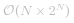

#### 解决方案

观察全排列/组合/子集问题，它们比较相似，且可以使用一些通用策略解决。

首先，它们的解空间非常大：

- [全排列](https://baike.baidu.com/item/%E5%85%A8%E6%8E%92%E5%88%97/4022220?fr=aladdin)：*N!*。

- [组合](https://baike.baidu.com/item/%E7%BB%84%E5%90%88%E6%95%B0/2153250)：*N!*。

- 子集：*2^N*，每个元素都可能存在或不存在。

在它们的指数级解法中，要确保生成的结果 ***完整*** 且 ***无冗余***，有三种常用的方法：

- 递归

- 回溯

- 基于二进制位掩码和对应位掩码之间的映射字典生成排列/组合/子集

相比前两种方法，第三种方法将每种情况都简化为二进制数，易于实现和验证。

此外，第三种方法具有最优的时间复杂度，可以生成按照字典顺序的输出结果。


#### 方法一：递归

**思路**

开始假设输出子集为空，每一步都向子集添加新的整数，并生成新的子集。

 [](https://pic.leetcode-cn.com/Figures/78/recursion.png)

```python [solution1-Python]
class Solution:
    def subsets(self, nums: List[int]) -> List[List[int]]:
        n = len(nums)
        output = [[]]
        
        for num in nums:
            output += [curr + [num] for curr in output]
        
        return output
```

```java [solution1-Java]
class Solution {
  public List<List<Integer>> subsets(int[] nums) {
    List<List<Integer>> output = new ArrayList();
    output.add(new ArrayList<Integer>());

    for (int num : nums) {
      List<List<Integer>> newSubsets = new ArrayList();
      for (List<Integer> curr : output) {
        newSubsets.add(new ArrayList<Integer>(curr){{add(num);}});
      }
      for (List<Integer> curr : newSubsets) {
        output.add(curr);
      }
    }
    return output;
  }
}
```

**复杂度分析**

* 时间复杂度： ，生成所有子集，并复制到输出结果中。
    
* 空间复杂度： ，这是子集的数量。

    - 对于给定的任意元素，它在子集中有两种情况，存在或者不存在（对应二进制中的 0 和 1）。因此，*N* 个数字共有 *2^N* 个子集。
   

#### 方法二：回溯

**算法**

> 幂集是所有长度从 0 到 n 所有子集的组合。

根据定义，该问题可以看作是从序列中生成幂集。

遍历 *子集长度*，通过 *回溯* 生成所有给定长度的子集。

 [](https://pic.leetcode-cn.com/Figures/78/combinations.png)

> [回溯法](https://baike.baidu.com/item/%E5%9B%9E%E6%BA%AF%E6%B3%95/86074?fr=aladdin)是一种探索所有潜在可能性找到解决方案的算法。如果当前方案不是正确的解决方案，或者不是最后一个正确的解决方案，则回溯法通过修改上一步的值继续寻找解决方案。

 [](https://pic.leetcode-cn.com/Figures/78/backtracking.png)

**算法**

定义一个回溯方法 `backtrack(first, curr)`，第一个参数为索引 `first`，第二个参数为当前子集 `curr`。

- 如果当前子集构造完成，将它添加到输出集合中。

- 否则，从 `first` 到 `n` 遍历索引 `i`。

    - 将整数 `nums[i]` 添加到当前子集 `curr`。

    - 继续向子集中添加整数：`backtrack(i + 1, curr)`。

    - 从 `curr` 中删除 `nums[i]` 进行回溯。

```python [solution2-Python]
class Solution:
    def subsets(self, nums: List[int]) -> List[List[int]]:
        def backtrack(first = 0, curr = []):
            # if the combination is done
            if len(curr) == k:  
                output.append(curr[:])
            for i in range(first, n):
                # add nums[i] into the current combination
                curr.append(nums[i])
                # use next integers to complete the combination
                backtrack(i + 1, curr)
                # backtrack
                curr.pop()
        
        output = []
        n = len(nums)
        for k in range(n + 1):
            backtrack()
        return output
```

```java [solution2-Java]
class Solution {
  List<List<Integer>> output = new ArrayList();
  int n, k;

  public void backtrack(int first, ArrayList<Integer> curr, int[] nums) {
    // if the combination is done
    if (curr.size() == k)
      output.add(new ArrayList(curr));

    for (int i = first; i < n; ++i) {
      // add i into the current combination
      curr.add(nums[i]);
      // use next integers to complete the combination
      backtrack(i + 1, curr, nums);
      // backtrack
      curr.remove(curr.size() - 1);
    }
  }

  public List<List<Integer>> subsets(int[] nums) {
    n = nums.length;
    for (k = 0; k < n + 1; ++k) {
      backtrack(0, new ArrayList<Integer>(), nums);
    }
    return output;
  }
}
```

**复杂度分析**

* 时间复杂度： ，生成所有子集，并复制到输出集合中。
 
* 空间复杂度： ，存储所有子集，共 *n* 个元素，每个元素都有可能存在或者不存在。


#### 方法三：字典排序（二进制排序） 子集

**思路**

该方法思路来自于 Donald E. Knuth。

> 将每个子集映射到长度为 n 的位掩码中，其中第 `i` 位掩码 `nums[i]` 为 `1`，表示第 `i` 个元素在子集中；如果第 `i` 位掩码 `nums[i]` 为 `0`，表示第 `i` 个元素不在子集中。

 [](https://pic.leetcode-cn.com/Figures/78/bitmask4.png)

例如，位掩码 `0..00`（全 0）表示空子集，位掩码 `1..11`（全 1）表示输入数组 `nums`。

因此要生成所有子集，只需要生成从 `0..00` 到 `1..11` 的所有 n 位掩码。

乍看起来生成二进制数很简单，但如何处理左边填充 0 是一个问题。因为必须生成固定长度的位掩码：例如 `001`，而不是 `1`。因此可以使用一些位操作技巧：

```python [snippet1-Python]
nth_bit = 1 << n
for i in range(2**n):
    # generate bitmask, from 0..00 to 1..11
    bitmask = bin(i | nth_bit)[3:]
```

```java [snippet1-Java]
int nthBit = 1 << n;
for (int i = 0; i < (int)Math.pow(2, n); ++i) {
    // generate bitmask, from 0..00 to 1..11
    String bitmask = Integer.toBinaryString(i | nthBit).substring(1);
```

或者使用简单但低效的迭代进行控制：

```python [snippet2-Python]
for i in range(2**n, 2**(n + 1)):
    # generate bitmask, from 0..00 to 1..11
    bitmask = bin(i)[3:]
```

```java [snippet2-Java]
for (int i = (int)Math.pow(2, n); i < (int)Math.pow(2, n + 1); ++i) {
  // generate bitmask, from 0..00 to 1..11
  String bitmask = Integer.toBinaryString(i).substring(1);
```

**算法**

- 生成所有长度为 n 的二进制位掩码。

- 将每个子集都映射到一个位掩码数：位掩码中第 `i` 位如果是 `1` 表示子集中存在 `nums[i]`，`0` 表示子集中不存在 `nums[i]`。

- 返回子集列表。

```python [solution3-Python]
class Solution:
    def subsets(self, nums: List[int]) -> List[List[int]]:
        n = len(nums)
        output = []
        
        for i in range(2**n, 2**(n + 1)):
            # generate bitmask, from 0..00 to 1..11
            bitmask = bin(i)[3:]
            
            # append subset corresponding to that bitmask
            output.append([nums[j] for j in range(n) if bitmask[j] == '1'])
        
        return output
```

```java [solution3-Java]
class Solution {
  public List<List<Integer>> subsets(int[] nums) {
    List<List<Integer>> output = new ArrayList();
    int n = nums.length;

    for (int i = (int)Math.pow(2, n); i < (int)Math.pow(2, n + 1); ++i) {
      // generate bitmask, from 0..00 to 1..11
      String bitmask = Integer.toBinaryString(i).substring(1);

      // append subset corresponding to that bitmask
      List<Integer> curr = new ArrayList();
      for (int j = 0; j < n; ++j) {
        if (bitmask.charAt(j) == '1') curr.add(nums[j]);
      }
      output.add(curr);
    }
    return output;
  }
}
```

**复杂度分析**

* 时间复杂度： ，生成所有的子集，并复制到输出列表中。
    
* 空间复杂度： ，存储所有子集，共 *n* 个元素，每个元素都有可能存在或者不存在。